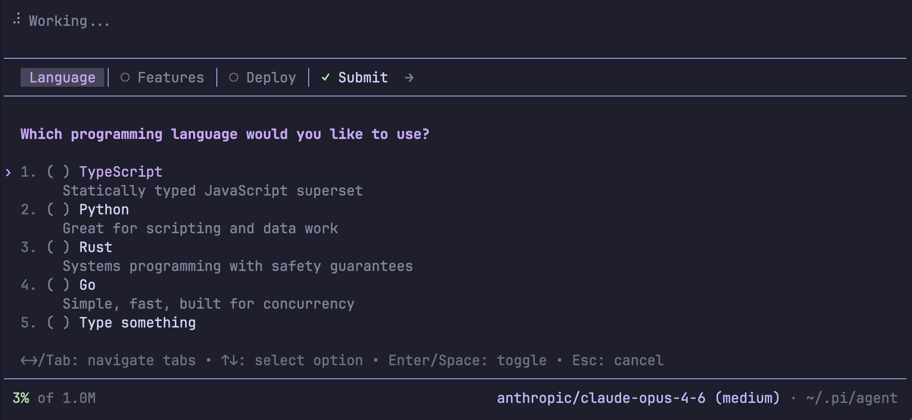

# Pi Interactive Form Extension

A [pi coding agent](https://github.com/badlogic/pi-mono) extension that provides an `interactive_form` tool — a tabbed form interface for gathering structured user input through selectable options and custom text.



## Features

- **Tabbed form UI** — present multiple questions as navigable tabs, each with its own set of options.
- **Single & multiple selection** — radio-button or checkbox style per tab.
- **Custom text input** — optionally allow free-text answers alongside predefined options.
- **Summary view** — review all responses on a final "Submit" tab before confirming.
- **Keyboard-driven** — full keyboard navigation (arrow keys, Tab, number keys, Enter/Space).

## Setup

### Prerequisites

- [pi coding agent](https://github.com/badlogic/pi-mono) installed and configured.

### Install via pi

```bash
# From git
pi install git:github.com/kirang89/pi-interactive-form

# Or from npm (once published)
pi install npm:pi-interactive-form
```

### Install manually

Copy (or symlink) the extension into your pi agent extensions directory:

```bash
mkdir -p ~/.pi/agent/extensions/interactive-form
cp extensions/*.ts ~/.pi/agent/extensions/interactive-form/
```

### Try without installing

```bash
pi -e git:github.com/kirang89/pi-interactive-form
```

### Verify

Restart pi (or run `/reload`). The `interactive_form` tool will be available to the agent.

## Usage

The agent calls the `interactive_form` tool when it needs to gather multiple pieces of information at once. Each invocation defines:

| Parameter | Type | Description |
|-----------|------|-------------|
| `title` | `string` | Form title displayed at the top |
| `tabs` | `Tab[]` | Array of question tabs (see below) |

### Tab Configuration

| Field | Type | Description |
|-------|------|-------------|
| `id` | `string` | Unique identifier for the tab |
| `label` | `string` | Short label shown in tab header (1–2 words) |
| `question` | `string` | The question to ask |
| `options` | `Option[]` | Available options (`value`, `label`, optional `description`) |
| `selectionType` | `"single"` \| `"multiple"` | Radio buttons or checkboxes |
| `allowCustom` | `boolean` | Whether to show a "Type something" free-text option |

### Keyboard Controls

| Key | Action |
|-----|--------|
| `←` `→` / `Tab` `Shift+Tab` | Navigate between tabs |
| `↑` `↓` | Move option cursor |
| `Enter` / `Space` | Toggle selection |
| `1`–`9` | Quick-select option by number |
| `Esc` | Cancel form (or exit custom input mode) |

### Example

The agent might call:

```json
{
  "title": "Project Setup",
  "tabs": [
    {
      "id": "language",
      "label": "Language",
      "question": "Which programming language?",
      "options": [
        { "value": "ts", "label": "TypeScript" },
        { "value": "py", "label": "Python" },
        { "value": "rs", "label": "Rust" }
      ],
      "selectionType": "single",
      "allowCustom": true
    },
    {
      "id": "features",
      "label": "Features",
      "question": "Which features do you need?",
      "options": [
        { "value": "auth", "label": "Authentication" },
        { "value": "db", "label": "Database" },
        { "value": "api", "label": "REST API" }
      ],
      "selectionType": "multiple",
      "allowCustom": false
    }
  ]
}
```

The user navigates tabs, selects options, and submits. The agent receives a formatted markdown response with all answers.
